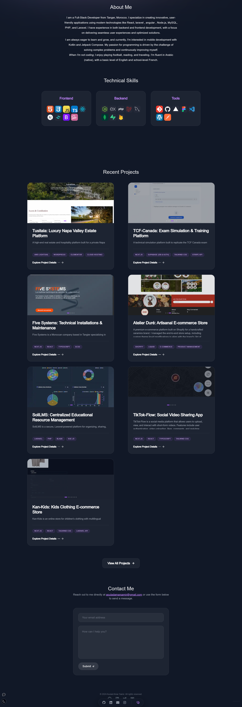
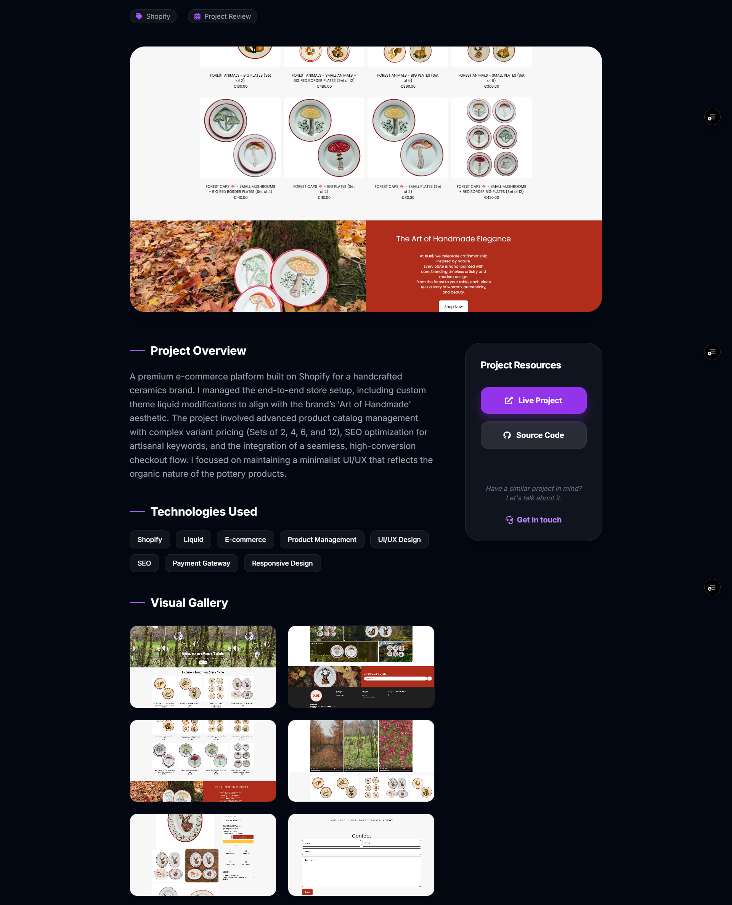

 
<div id="badges"  align="center">
<h1 align="center">

</h1> 
</div>
<div id="badges"  align="center">
    
 <h3>
 </h3>

  
<div align="center">
  <a href="https://skillicons.dev/icons?i=nextjs,react">
       <br>
    <div align="center"> 
    
      </a>
      <a target="blank" href="https://samiraouladamar-portfolio-l6znv46od-samir20-23s-projects.vercel.app/">
    
  </a>
  <br>
  <hr>
</div>
</div> 
 
---

 
 

 

## 🛠 Tech Stack

| Layer | Technology |
| :--- | :--- |
| **Framework** | Next.js 14 (App Router) |
| **Styling** | Tailwind CSS |
| **Animations** | Framer Motion |
| **Language** | TypeScript |
| **Email Service** | Resend & React Email |
| **State Management** | React Context API |

---

## 📂 Project Architecture

The application is structured for scalability and maintainability:

* **`/app`**: Contains the core routing and global styles.
* **`/components`**: Reusable UI elements (Intro, About, Projects, Skills, Contact).
* **`/actions`**: Next.js Server Actions for handling form logic (e.g., `sendEmail.ts`).
* **`/context`**: Global state for the UI theme and active navigation sections.
* **`/lib`**: Type definitions, utility functions, and central data management (`data.ts`).
* **`/public`**: Asset storage for project screenshots and CV files.

---

## ✨ Key Features

* **Serverless Contact Form**: Sends emails directly via Resend using Server Actions.
* **Adaptive UI**: Fully responsive design with a custom-built Light/Dark mode toggle.
* **Scroll Spy**: Navigation automatically updates based on the current section in view.
* **Optimized Assets**: Next.js Image component for lazy loading and layout stability.
* **Type Safety**: 100% TypeScript for robust development.

---

## 🚀 Getting Started

### 1. Prerequisites
Ensure you have **Node.js** (v18+) and **npm** or **Bun** installed.

### 2. Installation
```bash
# Clone the repository
git clone [Portfolio](https://github.com/samir20-23/Portfolio.git)

# Navigate to the project folder
cd Portfolio_nextJs

# Install dependencies
npm install

```

### 3. Environment Setup

Create a `.env.local` file in the root directory and add   Resend API key 
 

### 4. Run Development Server

```bash
npm run dev

```

Open [http://localhost:3000](https://www.google.com/search?q=http://localhost:3000) to view it in   browser.

---

## 🛠 Maintenance & Updates

* **Updating Projects**: Modify `lib/data.ts` or `lib/projects.ts` to add new work.
* **Styling**: All global themes are managed in `app/globals.css` and `tailwind.config.js`.
* **Images**: Place all new project screenshots in `/public/[project-folder]/`.

---

## 📄 License

© 2026 Samir Aoulad Amar. All rights reserved. Built with passion in Tangier, Morocco.


## 📫 Contact

For any inquiries or feedback, feel free to reach out to me at:  
**Email**: [aouladamarsamir@gmail.com](mailto:aouladamarsamir@gmail.com)

 