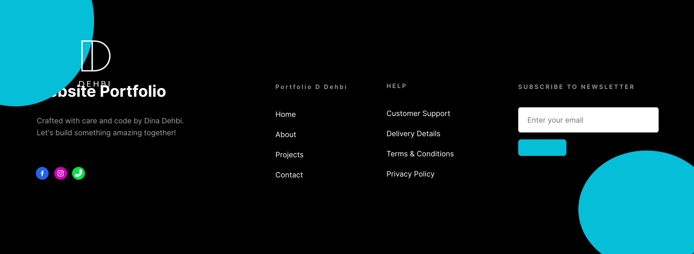

<h1 align="center">

</h1> 

 
 <h3>
 </h3>

  <a href="https://skillicons.dev/icons?i=nextjs,laravel,vuejs,react">
      
    
 
    
      </a>
       

 
   
 
   <h1>i will do inxaelah : </h1>

   

  

 
## 📫 Contact

For any inquiries or feedback, feel free to reach out to me at:  
**Email**: [aouladamarsamir@gmail.com](mailto:aouladamarsamir@gmail.com)

 
